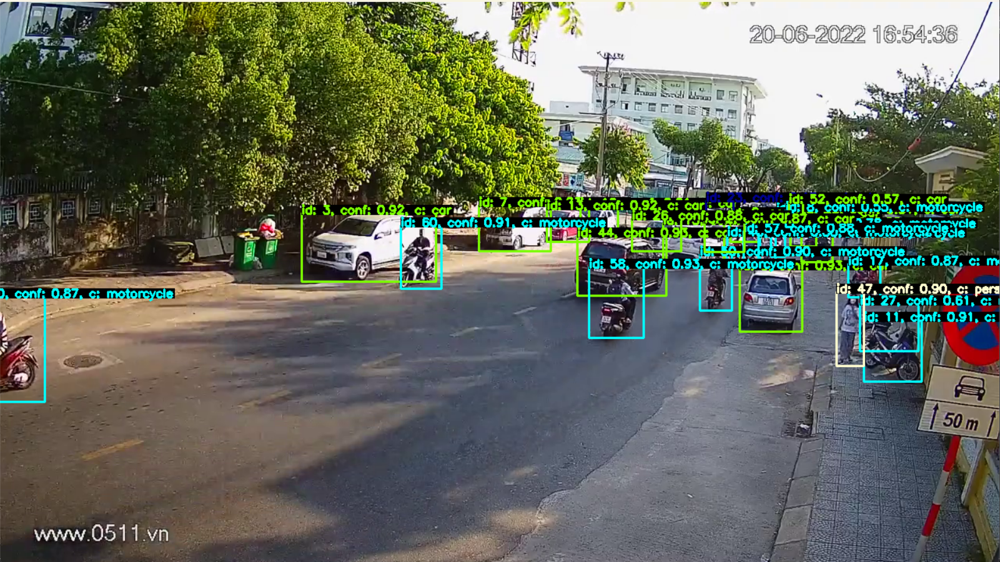

<a name="readme-top"></a>

<!-- PROJECT SHIELDS -->

[![Contributors][contributors-shield]][contributors-url]
[![Forks][forks-shield]][forks-url]
[![Stargazers][stars-shield]][stars-url]
[![Issues][issues-shield]][issues-url]
[![MIT License][license-shield]][license-url]

<br />
<div align="center">

<h3 align="center">Traffix</h3>

<p align="center">
    A comprehensive traffic network management solution
    <br />
    <br />
    <a href="https://github.com/notabota/traffix">View Demo</a>
    ·
    <a href="https://github.com/notabota/traffix/issues">Report Bug</a>
    ·
    <a href="https://github.com/notabota/traffix/issues">Request Feature</a>
  </p>
</div>

<!-- TABLE OF CONTENTS -->

<details>
  <summary>Table of Contents</summary>
  <ol>
    <li>
      <a href="#about-the-project">About The Project</a>
      <ul>
        <li><a href="#built-with">Built With</a></li>
      </ul>
    </li>
    <li>
      <a href="#getting-started">Getting Started</a>
      <ul>
        <li><a href="#prerequisites">Prerequisites</a></li>
        <li><a href="#installation">Installation</a></li>
      </ul>
    </li>
    <li><a href="#usage">Usage</a></li>
    <li><a href="#roadmap">Roadmap</a></li>
    <li><a href="#contributing">Contributing</a></li>
    <li><a href="#contact">Contact</a></li>
  </ol>
</details>

<!-- ABOUT THE PROJECT -->

## About The Project

The traffic network is the backbone of every residential area, and people have develop many technology to be able to handle the complexity of the transportation system, from numerous of sensor device to smart cameras. However, this numerous amount of information is usually disjointed and have to be processed manually in order to be useful.
<br />
<br />
This project is built as a completed solution to solve the difficulties of controlling the transit network data, include

* Integrate hardware devices with the back-end infrastructure through the IoT network.
* Automatically organize and process collected data from hardware devices using artificial intelligence
* Realtime database that is shared over authorized client, allow corporations to work and contribute together over a public knowledge base without wasting resources.
* Associated mobile and web application that allow user to monitor and interact with the traffic network system, and also be able to connect with the managers.

<!-- Use the `BLANK_README.md` to get started. -->

<p style="text-align: right;"><a href="#readme-top">back to top</a></p>

### Built With

[![PyTorch][PyTorch]][PyTorch-url]
[![OpenCV][]][OpenCV-url]
[![Firebase][Firebase]][Firebase-url]
[![Supabase][Supabase]][Supabase-url]

[PyTorch]: https://img.shields.io/badge/PyTorch-%23EE4C2C.svg?style=for-the-badge&logo=PyTorch&logoColor=white

[PyTorch-url]: https://pytorch.org/

[OpenCV]: https://img.shields.io/badge/opencv-%23white.svg?style=for-the-badge&logo=opencv&logoColor=white

[OpenCV-url]: https://opencv.org/


[Supabase]: https://img.shields.io/badge/Supabase-3ECF8E?style=for-the-badge&logo=supabase&logoColor=white

[Supabase-url]: https://supabase.com/

<p style="text-align: right;"><a href="#readme-top">back to top</a></p>

<!-- GETTING STARTED -->

## Getting Started

### Prerequisites

Install requirements

```sh
pip install -r requirements.txt
```
Refer to Supabase to see installation step <br /><br />
[![Supabase][Supabase]][Supabase-url]


### Running

```sh
python main.py
```

<p style="text-align: right;"><a href="#readme-top">back to top</a></p>

<!-- USAGE EXAMPLES -->

## Usage



<p style="text-align: right;"><a href="#readme-top">back to top</a></p>

<!-- ROADMAP -->

## Roadmap

- [X]  Connect to the camera system
- [X]  Perform object detection on video stream to extract information
- [X]  Integrate with the database
- [ ]  Create an hierarchical role system
- [ ]  Migrate to local self-hosted server

See the [open issues](https://github.com/notabota/traffix/issues) for a full list of proposed features (and known issues).

<p style="text-align: right;"><a href="#readme-top">back to top</a></p>

<!-- CONTRIBUTING -->

## Contributing

Contributions are what make the open source community such an amazing place to learn, inspire, and create. Any
contributions you make are **greatly appreciated**.

If you have a suggestion that would make this better, please fork the repo and create a pull request. You can also
simply open an issue with the tag "enhancement".

1. Fork the Project
2. Create your Feature Branch (`git checkout -b feature/AmazingFeature`)
3. Commit your Changes (`git commit -m 'Add some AmazingFeature'`)
4. Push to the Branch (`git push origin feature/AmazingFeature`)
5. Open a Pull Request

<p style="text-align: right;"><a href="#readme-top">back to top</a></p>

## Contact

Nguyễn Nguyên Vũ

* [![Gmail][gmail]]() - **nnv2205owo@gmail.com**
* [![Facebook][facebook]](https://www.facebook.com/nnv2205owo/) - **facebook.com/nnv2205owo**
* [![LinkedIn][linkedin]](https://www.linkedin.com/in/nnv2205owo/) - **linkedin.com/in/nnv2205owo**
* [![Upwork][upwork]](https://www.upwork.com/freelancers/~012078434f80806fe1) - **upwork.com/freelancers/~
  012078434f80806fe1**

Project Link: [https://github.com/notabota/traffix](https://github.com/notabota/traffix)

<p style="text-align: right;"><a href="#readme-top">back to top</a></p>

<!-- MARKDOWN LINKS & IMAGES -->

[Firebase]: https://img.shields.io/badge/firebase-%23039BE5.svg?style=for-the-badge&logo=firebase

[Firebase-url]: https://firebase.google.com/

[contributors-shield]: https://img.shields.io/github/contributors/notabota/traffix.svg?style=for-the-badge

[contributors-url]: https://github.com/notabota/traffix/graphs/contributors

[forks-shield]: https://img.shields.io/github/forks/notabota/traffix.svg?style=for-the-badge

[forks-url]: https://github.com/notabota/traffix/network/members

[stars-shield]: https://img.shields.io/github/stars/notabota/traffix.svg?style=for-the-badge

[stars-url]: https://github.com/notabota/traffix/stargazers

[issues-shield]: https://img.shields.io/github/issues/notabota/traffix.svg?style=for-the-badge

[issues-url]: https://github.com/notabota/traffix/issues

[license-shield]: https://img.shields.io/github/license/notabota/traffix.svg?style=for-the-badge

[license-url]: https://github.com/notabota/traffix/blob/master/LICENSE.txt

[linkedin-shield]: https://img.shields.io/badge/-LinkedIn-black.svg?style=for-the-badge&logo=linkedin&colorB=555

[linkedin-url]: https://linkedin.com/in/nnv2205owo

[facebook]: https://img.shields.io/badge/Facebook-1877F2?style=for-the-badge&logo=facebook&logoColor=white

[gmail]: https://img.shields.io/badge/Gmail-D14836?style=for-the-badge&logo=gmail&logoColor=white

[linkedin]: https://img.shields.io/badge/LinkedIn-0077B5?style=for-the-badge&logo=linkedin&logoColor=white

[upwork]: https://img.shields.io/badge/UpWork-6FDA44?style=for-the-badge&logo=Upwork&logoColor=white
